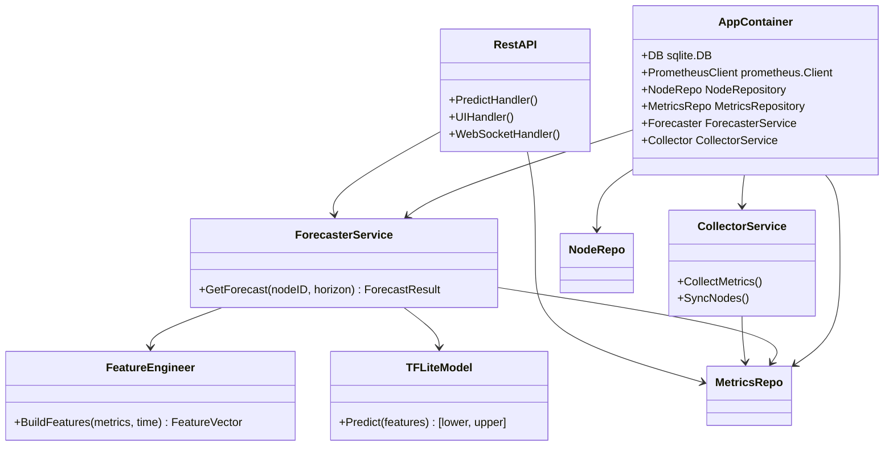

# Схема зв'язків між класами та компонентами системи

```mermaid
classDiagram
    class AppContainer {
        +DB sqlite.DB
        +PrometheusClient prometheus.Client
        +NodeRepo NodeRepository
        +MetricsRepo MetricsRepository
        +Forecaster ForecasterService
        +Collector CollectorService
    }
    
    class ForecasterService {
        +GetForecast(nodeID, horizon) ForecastResult
    }
    
    class FeatureEngineer {
        +BuildFeatures(metrics, time) FeatureVector
    }
    
    class TFLiteModel {
        +Predict(features) [lower, upper]
    }
    
    class CollectorService {
        +CollectMetrics()
        +SyncNodes()
    }
    
    class RestAPI {
        +PredictHandler()
        +UIHandler()
        +WebSocketHandler()
    }

    AppContainer --> ForecasterService
    AppContainer --> CollectorService
    AppContainer --> NodeRepo
    AppContainer --> MetricsRepo

    ForecasterService --> FeatureEngineer
    ForecasterService --> TFLiteModel
    ForecasterService --> MetricsRepo

    CollectorService --> MetricsRepo
    RestAPI --> ForecasterService
    RestAPI --> MetricsRepo
```
