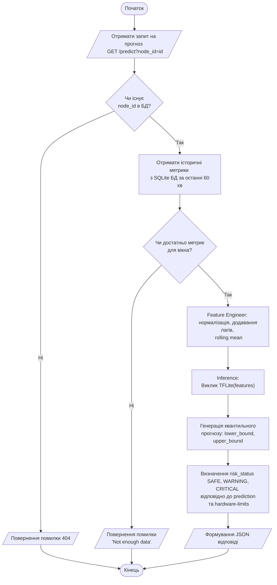

# Блок-схема алгоритмів

Ця схема показує загальний процес отримання прогнозу через систему (ISO 5807:2016).

```mermaid
flowchart TD
    %% Start
    Start([Початок]) --> A[/"Отримати запит на прогноз \n GET /predict?node_id=id"/]

    %% Process
    A --> B{"Чи існує \n node_id в БД?"}
    B -- Ні --> Error1[/"Повернення помилки 404"/]
    B -- Так --> C["Отримати історичні метрики \n з SQLite БД за останні 60 хв"]

    C --> D{"Чи достатньо метрик \n для вікна?"}
    D -- Ні --> Error2[/"Повернення помилки \n 'Not enough data'"/]
    D -- Так --> E["Feature Engineer: \n нормалізація, додавання лагів, \n rolling mean"]

    E --> F["Inference: \n Виклик TFLite(features)"]
    F --> G["Генерація квантильного\n прогнозу: lower_bound, upper_bound"]
    
    G --> H["Визначення risk_status \n SAFE, WARNING, CRITICAL \n відповідно до prediction \n та hardware-limits"]

    H --> I[/"Формування JSON відповіді"/]
    Error1 --> J([Кінець])
    Error2 --> J
    I --> J
```
