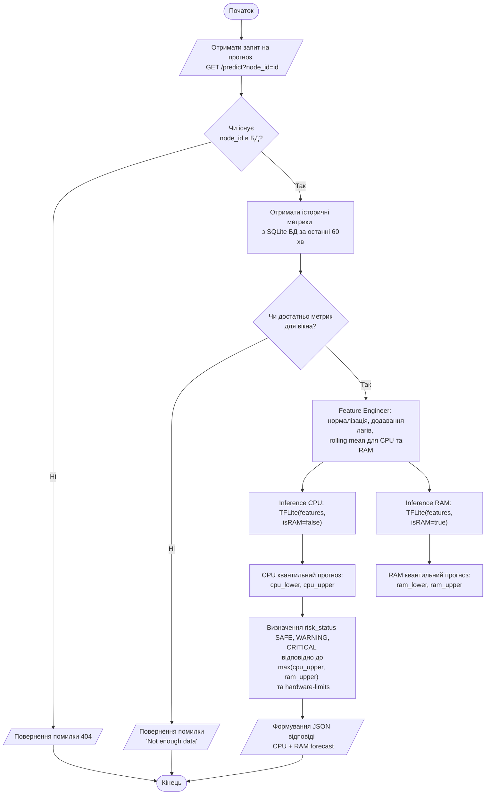

# Блок-схема алгоритмів

Ця схема показує загальний процес отримання прогнозу через систему (ISO 5807:2016).

### Опис кроків:
1. **Отримання метрик** - запит останніх 61 метрики для формування вікон та лагів
2. **Feature Engineering** - для кожного ресурсу (CPU/RAM) обчислюються:
   - Лаги (lag1, lag2, lag3, lag5, lag10, lag15, lag30)
   - Rolling statistics (mean/max для вікон 5, 15, 60 хв)
   - Часові ознаки (година, день тижня)
   - Нормалізація через MinMaxScaler
3. **Inference** - паралельне виконання для CPU та RAM моделей
4. **Визначення ризику** - максимальний upper bound з обох ресурсів порівнюється з SafeBoundary
