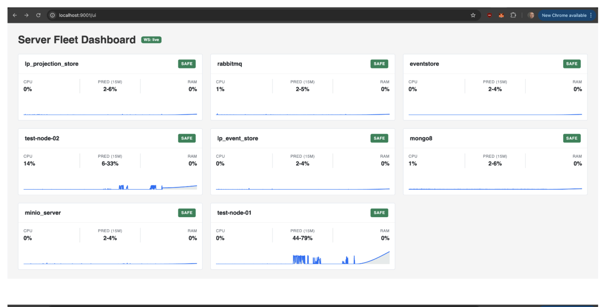
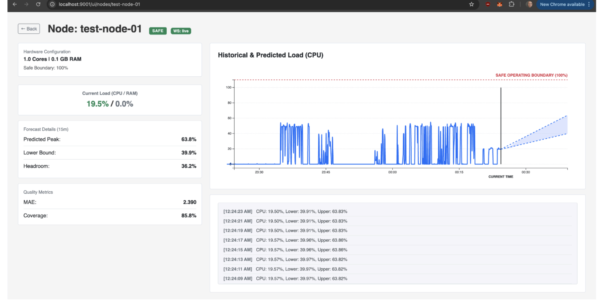

# 7. Огляд кожного функціонального елементу інтерфейсу

## Екрани та їх елементи:

### Головна сторінка (Dashboard):

* **Список вузлів (Node Cards):**
  * **Заголовок:** Назва сервера (наприклад, `test-node-01`).
  * **Статус-індикатор:** Значок або текст (`SAFE`, `WARNING`, `CRITICAL`), який відображає ймовірність перевантаження вузла на 15 хв горизонті.
  * **Поточне CPU/RAM:** Показники миттєвого використання ресурсів у відсотках.
  * **Прогнозні піки:** Прогнозована верхня та нижня межа завантаженості підсистеми;
  * **Графік (Mini Chart):** Спрощена лінійна діаграма зі зміною навантаження за останню годину.
  * **Кнопка "Details":** Перехід на сторінку "Node Details".

### Деталі вузла (Node Details):

* **Кнопка "Back to dashboard":** Повернення до таблиці вузлів.
* **Блок Hardware Profile:**
  * Відображає кількість ядер процесора (CPU cores) та об'єм оперативної пам'яті (RAM (GB)).
  * Safe operating boundary (безпечна межа).
* **Блок Metrics & Forecast:** Поточне значення навантаження CPU та RAM, нижня та верхня межі (для інтервального прогнозу на 15 хв вперед).
* **Прогнозний Графік (Main Chart):** Відображає історичні дані навантаження, лінію поточного моменту та затінену зону майбутнього (коридор прогнозу — від нижнього до верхнього квантилів) на 15 хв і горизонтальні порогові лінії (наприклад, 80% RAM).
* **Блок Quality Metrics:** Тут представлені MAE (Mean Absolute Error) і Coverage (коефіцієнт покриття) для оцінки точності прогнозу моделі.
