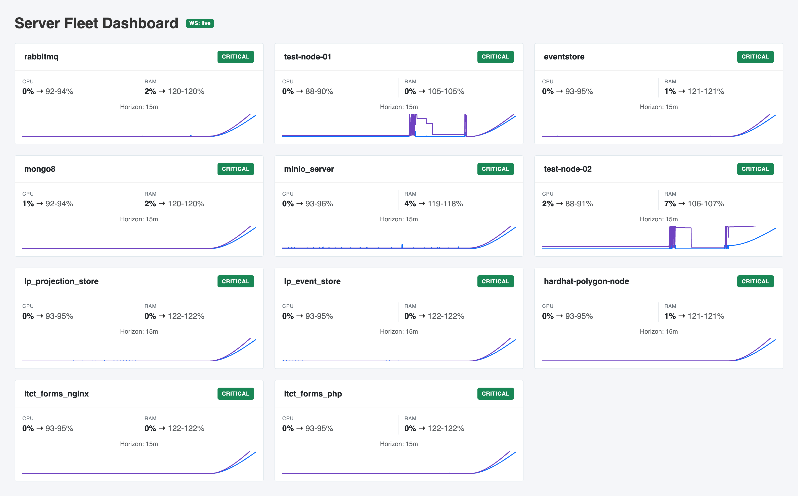
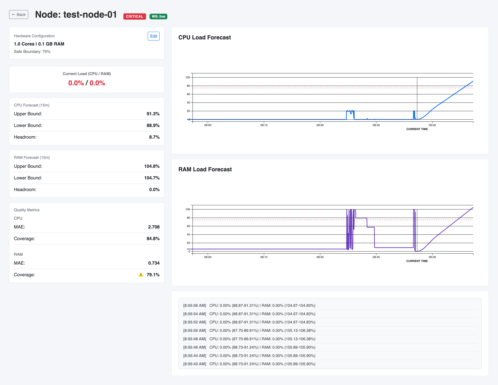

# 7. Огляд кожного функціонального елементу інтерфейсу

## Екрани та їх елементи:

### Головна сторінка (Dashboard):

* **Список вузлів (Node Cards):**
  * **Заголовок:** Назва сервера (наприклад, `test-node-01`).
  * **Статус-індикатор:** Значок або текст (`SAFE`, `WARNING`, `CRITICAL`), який відображає ймовірність перевантаження вузла на 15 хв горизонті.
  * **Поточне CPU:** Показник миттєвого використання CPU у відсотках.
  * **Прогноз CPU:** Нижня та верхня межа прогнозованого навантаження CPU.
  * **Поточне RAM:** Показник миттєвого використання RAM у відсотках.
  * **Прогноз RAM:** Нижня та верхня межа прогнозованого навантаження RAM.
  * **Графік (Mini Chart):** Спрощена лінійна діаграма зі зміною навантаження CPU та RAM за останню годину. CPU - синя лінія, RAM - фіолетова.
  * **Кнопка "Details":** Перехід на сторінку "Node Details".

### Деталі вузла (Node Details):

* **Кнопка "Back to dashboard":** Повернення до таблиці вузлів.
* **Блок Hardware Profile:**
  * Відображає кількість ядер процесора (CPU cores) та об'єм оперативної пам'яті (RAM (GB)).
  * Safe operating boundary (безпечна межа).
* **Блок Current Load:** Поточне значення навантаження CPU та RAM у відсотках.
* **Блок CPU Forecast:** Нижня та верхня межі інтервального прогнозу CPU на 15 хв вперед.
* **Блок RAM Forecast:** Нижня та верхня межі інтервального прогнозу RAM на 15 хв вперед.
* **Блок Quality Metrics:** MAE та Coverage для кожного ресурсу (CPU та RAM) окремо.
* **Прогнозні Графіки (Main Charts):** 
  * Відображає історичні дані навантаження для CPU та RAM.
  * Лінія поточного моменту та затінена зона майбутнього (коридор прогнозу).
  * Горизонтальна порогова лінія SafeBoundary.
